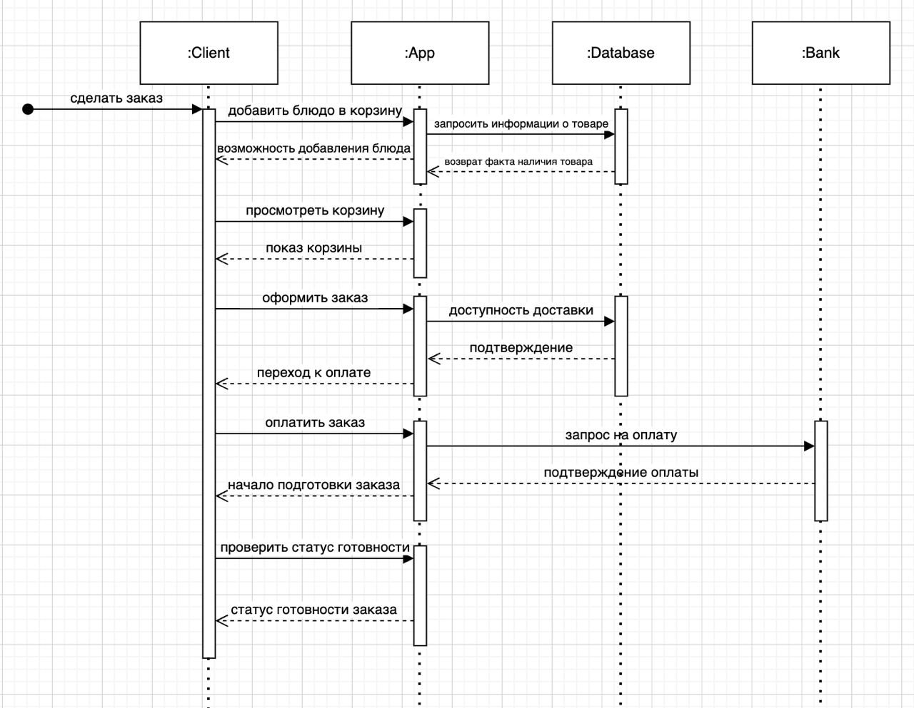

# Техническое задание №3 (ТЗ3)
## Легенда задания
Наверное, каждый из вас хоть раз заказывал доставку еды через мобильное приложение. Если нет - можете посмотреть, как работают подобные сервисы, например, Яндекс.Еда или Delivery Club. Вам необходимо спроектировать подобное приложение. Понятно, что вы не можете в деталях знать, как устроена работа подобных систем с ресторанами и курьерами - но от вас и не требуется описать то, как работает в данных системах. Вы можете предложить любые процессы и сценарии на ваше усмотрение, главное, чтобы они были логичны и реализуемы.
## Описание системы
Система онлайн-заказа и доставки еды представляет собой инновационное решение, призванное упростить процесс заказа блюд из ресторанов и их доставки на дом. Она обеспечивает удобный и интуитивно понятный интерфейс для пользователей, помогает ресторанам эффективно управлять заказами и повышает общий уровень обслуживания клиентов.

Основной компонент системы – это интерфейс пользователя, доступный через веб-сайт и мобильное приложение. Регистрация и авторизация занимают минимум времени и могут быть осуществлены через электронную почту, номер телефона или социальные сети. Пользователь получает доступ к полному меню ресторана, где каждое блюдо сопровождается описанием, фотографиями и ценами. Благодаря удобным функциям фильтрации и поиска клиенты могут легко находить блюда, соответствующие их предпочтениям, например, вегетарианские или безглютеновые.

Процесс заказа также максимально упрощен: добавление блюд в корзину, редактирование позиций и окончательное оформление заказа занимают всего несколько минут. Клиент может выбрать способ доставки – на дом или самовывоз, указать адрес, рассчитать общую стоимость заказа и применить промокоды или скидки. Система поддерживает разнообразные способы оплаты, включая банковские карты, электронные кошельки и наличные при доставке. После оформления заказа клиент может отслеживать его статус в режиме реального времени, что обеспечивает прозрачность и уверенность в своевременной доставке.

Интерфейс ресторана предназначен для эффективного управления меню и обработки заказов. Ресторан может добавлять, редактировать и удалять блюда, устанавливать акции и специальные предложения. Система уведомлений о новых заказах и возможность управления их статусами упрощают работу персонала. Кроме того, встроенные аналитические инструменты позволяют отслеживать статистику продаж, выявлять популярные блюда и анализировать отзывы клиентов, что способствует постоянному улучшению сервиса.

Важной частью системы является логистика и доставка. Система управления доставкой оптимизирует маршруты для курьеров, учитывает время доставки и интегрируется с картографическими сервисами для точного определения местоположения клиентов. Курьеры используют специализированное приложение, которое помогает им навигировать, подтверждать получение заказа и взаимодействовать с клиентами.

Не менее важной составляющей является обратная связь и поддержка клиентов. Клиенты могут оставлять отзывы и оценки по заказанным блюдам и работе курьеров, что помогает ресторанам улучшать свои услуги. Служба поддержки, работающая круглосуточно, обеспечивает оперативное решение любых вопросов и проблем, возникающих у пользователей.

Система онлайн-заказа и доставки еды обладает рядом значительных преимуществ. Она предлагает удобство и простоту оформления заказов, доступность сервиса 24/7, прозрачность в отслеживании статуса заказов и времени доставки. Персонализированные рекомендации и предложения, основанные на предыдущих заказах и предпочтениях клиентов, делают использование системы еще более приятным. Автоматизация процессов приема и обработки заказов снижает нагрузку на персонал ресторана и увеличивает его эффективность, а также привлекает новых клиентов за счет онлайн-присутствия и возможности проведения акций и специальных предложений.

Таким образом, система онлайн-заказа и доставки еды представляет собой комплексное решение для ресторанного бизнеса, направленное на улучшение качества обслуживания клиентов и повышение эффективности работы ресторанов. Она объединяет все необходимые функции для создания удобного и современного сервиса, отвечающего потребностям как клиентов, так и ресторанов.
## Диаграмма вариантов использования

В данной диаграмме акторами являются доставщик еды, ресторан, а также сам покупатель(клиент). У покупателя есть функции "Авторизация/регистрация в приложении", а также "Заказ еды в приложении". Вторя функция имеет функции-наследники "Оформление и оплата заказа", "Просмотр статуса готовности заказа". Второй актор, доставщик еды, может откликаться на заказ в приложении, а также доставлять заказ покупателю. Первая из функция из данных двух имеет того же наследника, что и одна из функций покупателя, а именно "Просмотр статуса готовности заказа". Последний актор, ресторан, может также откликаться на заказ в приложении, а еще подготавливать заказ, что включает в себя готовку блюд на кухне и сборку заказа.
## Диаграмма последовательности для процесса заказа еды через приложение

На данной диаграмме показаны действия, происходящие в рамках процесса заказа еды на дом в приложении. Все процессы, представленные на диаграмме, затрагивают 4 объекта. Первый-клиент, то есть тот, кто заказывает еду. С ним связаны все сценарии, указанные на диаграмме. Вторым объектом, который также участвует во всех сценариях, является приложение, ведь именно через него клиент совершает все свои действия в течение заказа еды. Третий объект-база данных, в которую обращается приложение для уточнения данных при заказе. Таким образом, через базу данных можно узнать, есть ли в наличии определенное блюдо, а также проверить доступность доставки из ресторана. Последним объектом является банк, который задействуется при оплате клиентом сделанного им заказа.
## Диаграмма состояний для заказа

Диаграмма состояний начинается с открытия приложения и последующего ввода данных для входа в свою учетную запись. При некорректных данных пользователь повторяет попытки входа до тех пор, пока введенные им логин и пароль не будут верными. Далее пользователь переходит на главное меню, а оттуда-на страницу выбора блюд. При появлении ошибки при добавлении желаемого блюда пользователь возвращается в главное меню, иначе-переходит к просмотру корзины, откуда возвращается к процессу выбора блюд, если клиент не добавил все, что хотел. После окончательного добавленных блюд покупатель переходит к оплате, откуда при корректности операции он попадает на вкладку ожидания заказа, где может проверять статус готовности до тех пор, пока заказанные им блюда не будут доставлены. После получения заказа процесс заканчивается.
## Диаграмма деятельности для описания процесса обработки заказа системой

В начале процесса система проверяет факт аутентификации пользователя. При конечном верном вводе данных клиент попадает в главное меню, из которого системой может быть принято три сценария: запрос на добавление блюда в корзину(далее идет проверка на наличие запрашиваемого в списке доступных к заказу блюд и переход обратно, в главное меню), запрос на оплату(пользователь перенаправляется на страницу оплаты, откуда при ошибке попадает на главное меню, иначе-переходит к страницу ожидания), перевод на страницу ожидания заказа(пользователь остается здесь до окончания готовности заказа). После выполнения последнего из данных процессов пользователь перенаправляется на страницу с благодарностью за заказ, далее процесс обработки заказа системой окончен.
## Диаграмма классов для системы

В данной диаграмме присутствует всего 7 классов. Поля и методы указаны на диаграмме, далее в тексте будут представлены только отношения ассоциации между классами. Первый, Restaurant, связан с двумя другими классами, Deliveryman и Order, характеризующими доставщика еды и заказ клиента соответственно. Только единственный ресторан может отдавать конкретные заказы доставщику, причем абсолютно любому, либо не выдавать их никому при полном отсутствии заказов. Заказов может быть сколько угодно(в пределах разумного), следовательно и доставщиков, и заказов у ресторана может быть от 0 до n штук. По такой же логике можно заявить, что у доставщика(Deliveryman) может быть любое посильное ему количество заказов(Order), от 0 до n. Переходя к классу Order, заметим, что кроме классов Deliveryman и Restaurant, есть еще связанные с ним классы Cart и User(Корзина и Пользователь). Класс Cart связан с классом Order в отношении 1 к 1, так как одна корзина может оноситься только к одному конкретному заказу пользователя. Также Cart связан с классом Menu. Из одного меню составляются всевозможные корзины блюд, следовательно для одного меню можно составить от 0 до n вариаций корзин. Переходя к классу User, заметим, что связь с Order такая, которая указана на диаграмме, потому что одновремменно пользователь может иметь бесконечное множество не связанных между собой заказов. Также, в зависимости от заказа, User оплачивает выложенные им заказы(от 0 до n заказов, что описано ранее), поэтому класс User связан с классом Payment, являющимся классом, характеризующим оплату сделанного пользователем заказа.
